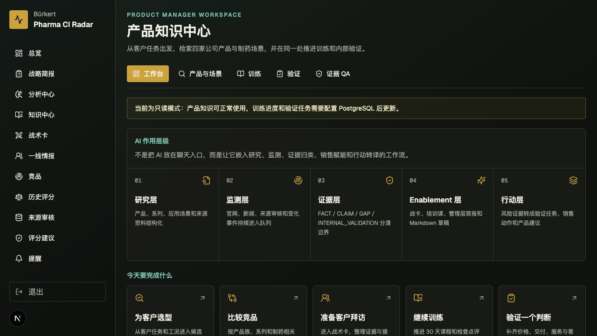
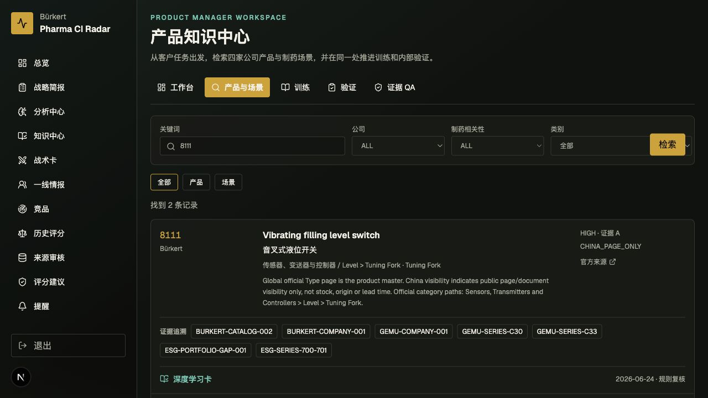
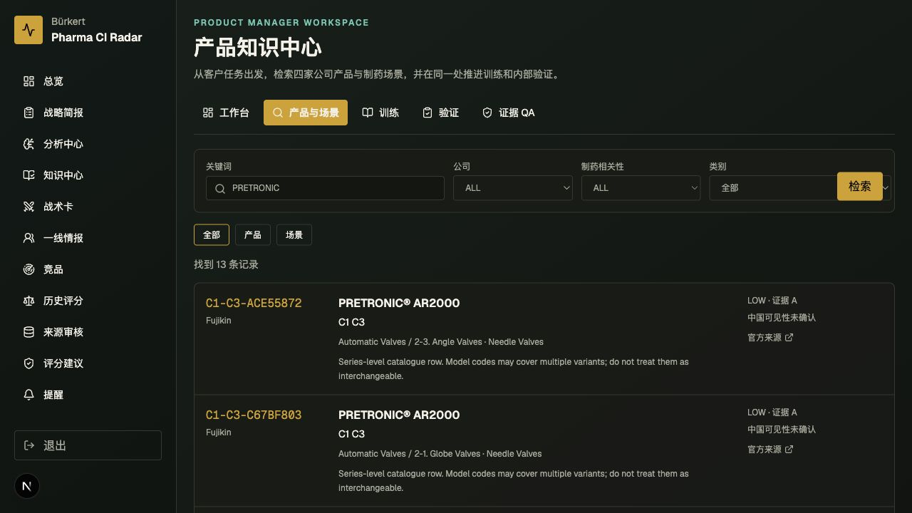
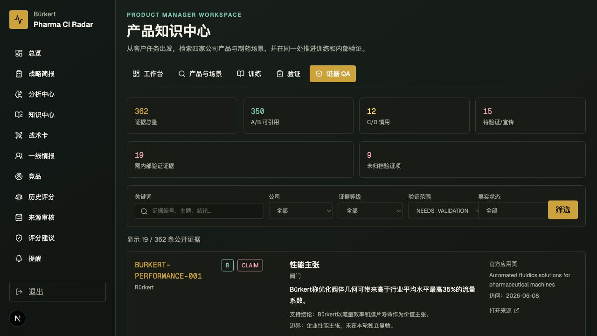
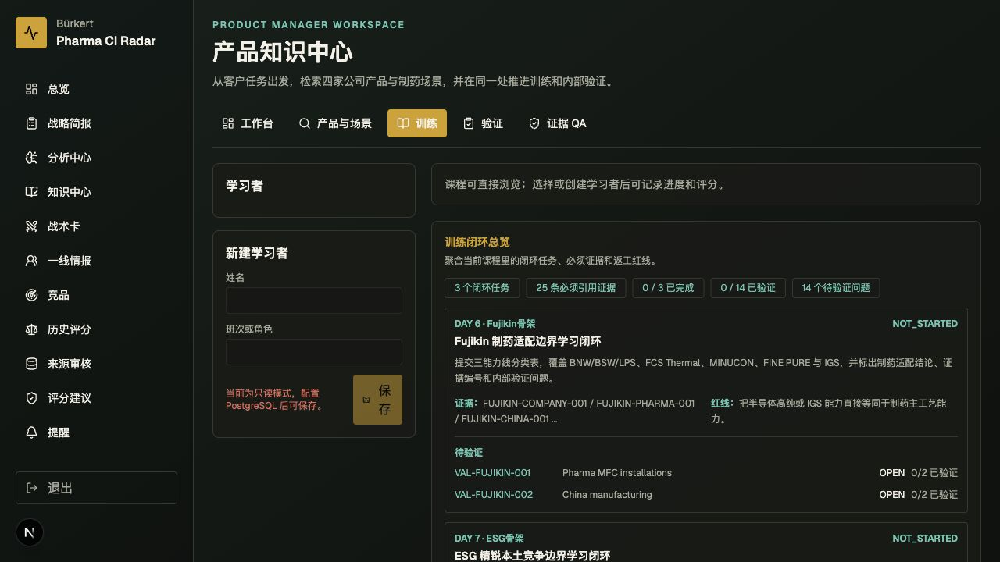
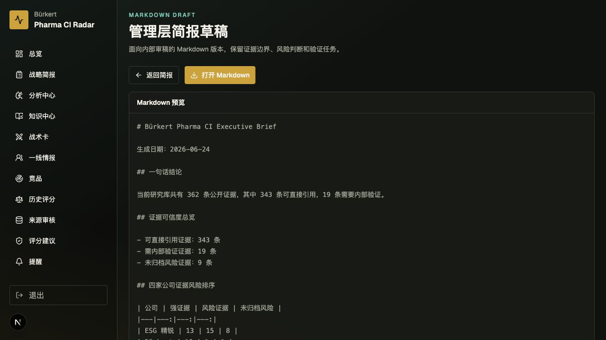

# 知识中心网页演示验收清单

验收日期：2026-06-24

本地入口：`http://127.0.0.1:3000/knowledge`

验收结论：8 条演示路径均可访问，关键页面状态可见，未发现旧竞品映射文案 `public series mapping incomplete` 或 `具体系列待映射`。

## 1. 知识中心总览

- 页面路径：`/knowledge`
- 页面状态：可见 511 个 Bürkert Type、307 条竞品系列记录、343 条可引用证据、16 项验证任务入口。
- 讲解词：这不是一个聊天入口，而是把研究、证据、训练、验证和管理层输出接成同一条竞争情报工作流。

## 2. Type 8111 产品学习

- 页面路径：`/knowledge?view=products&q=8111`
- 页面状态：搜索返回 2 条记录；Type 8111 显示深度学习卡、证据追溯和 `2026-06-24 · 规则复核`。
- 讲解词：从一个具体 Type 可以直接进入产品原理、选型必问、排除条件和竞品映射，避免只看 SKU 名称做判断。

## 3. Fujikin PRETRONIC 更新验证

- 页面路径：`/knowledge?view=products&q=PRETRONIC`
- 页面状态：搜索返回 13 条记录；PRETRONIC 系列可见，页面不再出现过时的 Fujikin 映射缺口文案。
- 讲解词：Fujikin 这里证明的是电动阀和执行器集成控制能力，不能直接等同为独立卫生控制头产品线。

## 4. 证据 QA 待验证

- 页面路径：`/knowledge?view=evidence&risk=NEEDS_VALIDATION`
- 页面状态：可见 362 条证据总量、350 条 A/B 可引用、19 条需内部验证证据和 9 条未归档验证项。
- 讲解词：这里用于守住证据边界，把 FACT、CLAIM、GAP 和 INTERNAL_VALIDATION 分开，防止宣传语被误升级成事实。

## 5. 内部验证工作区

- 页面路径：`/knowledge?view=validation`
- 页面状态：可见 P0 队列、公司筛选、验证状态筛选和 16 项内部验证任务。
- 讲解词：公开资料只能证明产品和声明存在，价格、交期、证书原件、装机和服务体验必须走内部验证任务闭环。

## 6. 训练闭环工作区

- 页面路径：`/knowledge?view=training`
- 页面状态：可见训练闭环总览、3 个闭环任务、25 条必须引用证据和待验证问题计数。
- 讲解词：训练不是看完资料就结束，而是要求学员用证据、产品边界和验证问题完成可检查的输出。

## 7. 管理层简报

- 页面路径：`/briefing`
- 页面状态：可见重点威胁、高威胁、行动分工、证据可信度和 Top 内部验证任务。
- 讲解词：管理层看到的是压缩后的行动判断，详细证据和验证任务仍保留可追溯路径。

## 8. Markdown 简报草稿

- 页面路径：`/briefing/markdown`
- 页面状态：可见 Markdown 预览，生成日期为 2026-06-24，并保留证据边界、风险判断和验证任务。
- 讲解词：这页把网页判断导出成可审稿、可转发的简报草稿，方便进入管理会议材料流。

## 演示边界

- 公开资料证明产品存在、公开能力和企业声明，不证明中国现货、实际净价、真实交期或装机口碑。
- 企业宣传保留 `CLAIM`，资料不足保留 `GAP` 或 `INTERNAL_VALIDATION`。
- 威胁等级与证据可信度分开说明，不能把“资料多”直接等同于“威胁高”。
